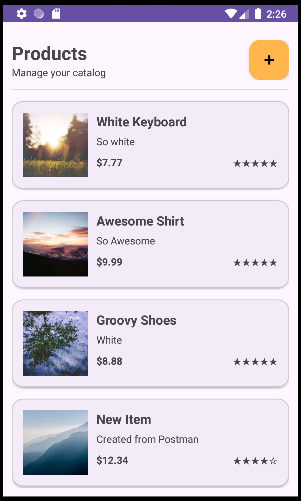
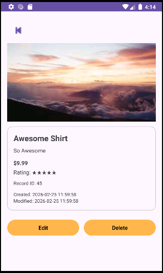

# Android Product Catalog

Kotlin Android app for browsing and viewing product data.

## Preview

  
  

## Features

- Product list view
- Product detail view
- Mobile UI built in Android
- Displays product information from app data / API

## Tech Used

- Kotlin
- Android Studio
- RecyclerView
- XML layouts

## How to Run

1. Open the project in Android Studio
2. Let Gradle sync
3. Run the app on an emulator or Android device

## Notes

This project is part of my portfolio and focuses on Android UI, app structure, and product display functionality.
